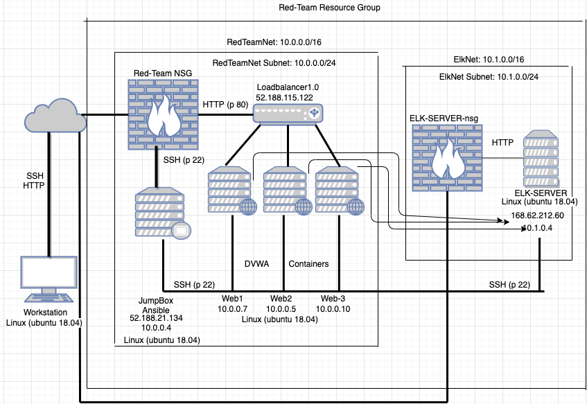
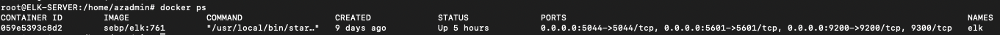

# ELK-Stack-Project
The files in this repository were used to configure the network depicted below. 

These files have been tested and used to generate a live ELK deployment on Azure. They can be used to either recreate the entire deployment pictured above. Alternatively, select portions of the config file may be used to install only certain pieces of it, such as Filebeat.

  YAML

This document contains the following details:
- Description of the Topology
- Access Policies
- ELK Configuration
  - Beats in Use
  - Machines Being Monitored
- How to Use the Ansible Build

### Description of the Topology

The main purpose of this network is to expose a load-balanced and monitored instance of DVWA, the D*mn Vulnerable Web Application.

Load balancing is key to almost all network flow. It ensures high availability and restricts inbound network traffic. 

The first machine that should be created is the jump box, which is a secure access point allowing the creation of an entire virtual network designed with security implemented from the ground up. For this project Ansible was used to allow for automated deployment of VMs. Starting with the creation of an Azure Resource Group followed by a Virtual Network and Network Security Group. 

Configuration is made simple with docker and ansible. It is important to note that docker runs as a container on the VM with ansible running inside of it. 

Integrating an ELK server allows users to easily monitor the vulnerable VMs for changes to the server metrics and system files. Filebeat is configured from Kibana and collects logs while Metricbeat also configured in Kibana records metrics and statistics

| Name     | Function | IP Address | Operating System |
|----------|----------|------------|------------------|
| Jump Box | Gateway  | 10.0.0.4   | Ubuntu 18.04-LTS |
| Web1     | Webserver| 10.0.0.7   | Ubuntu 18.04-LTS |
| Web2     | Webserver| 10.0.0.5   | Ubuntu 18.04-LTS |
| Web3     | Webserver| 10.0.0.10  | Ubuntu 18.04-LTS |
| ELK      | Monitoring| 10.1.0.4   | Ubuntu 18.04-LTS |

### Access Policies

A summary of the access policies in place can be found in the table below.

|**NSG**| | | | |
|:-------------:|:-----------:|:--------------:|:----:|:--------:|
|Name|Ports|Protocol|Source|Destination|
|allow_ssh| 22 | TCP | Home IP | 10.0.0.4|
|http_from_home | 80 | TCP | Home IP | Virtual Network |
|AllowVnetInBound | Any | Any | Virtual Network |
|AllowAzureLoadBalancerInBound| Any | Any | AzureLoadBalancer|
|DenyAllInBound| Any | Any | Any|
|**ELK-SERVER-nsg**| | | | |
|Name|Ports|Protocol|Source|Destination|
|ssh_from_jumpbox         | 22 | TCP | Home IP | 10.0.0.4|
|access_from_home         | 80 | TCP | Jump Box Public IP | 10.1.0.4 |
|AllowVnetInBound | Any | Any | Virtual Network |
|AllowAzureLoadBalancerInBound| Any | Any | AzureLoadBalancer|
|DenyAllInBound| Any | Any | Any|

### Elk Configuration

Ansible was used to automate configuration of the ELK machine. No configuration was performed manually, which is advantageous because you can configure and deploy to multiple machines with one play

The playbook implements the following tasks:
Install docker.io
Install pip3
Install docker python module
Use more memory_
Enable docker service
Download and lauch elk container

The following screenshot displays the result of running `docker ps` after successfully configuring the ELK instance.

### Target Machines & Beats
This ELK server is configured to monitor the following machines:
10.0.0.5
10.0.0.7
10.0.010

We have installed the following Beats on these machines:
Filebeat-7.6.1
Metricbeat-7.6.1

These Beats allow us to collect the following information from each machine:
Filebeat collects logs from machines in your network. You can specify what kind of logs you want it to collect.
Metricbeat measure metricsets that are available. This includes container, cpu, diskio, healthcheck, info, memory, and network. Image metricset is not enabled by default.

### Using the Playbook
In order to use the playbook, you will need to have an Ansible control node already configured. Assuming you have such a control node provisioned and your Azure VMs properly configured. 

SSH into the control node and follow the steps below:
Copy the filebeat-playbook.yml /etc/ansible/roles/
Hosts file. Specify which machines within the respective config file.
http://<ELK machine ip>:5601 /app/kibana

